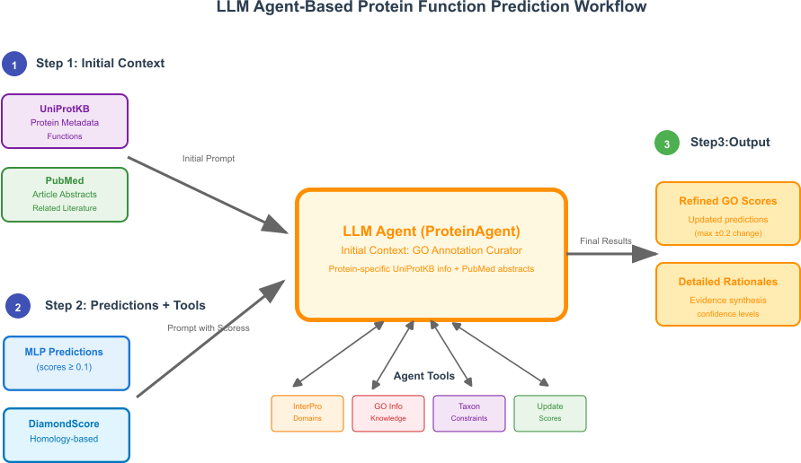

# Multi-agent protein function prediction

<div align="center">

</div>

## Requirements

- Python 3.10
- PyTorch
- CAMEL-AI

## Setup

```bash
conda env create -f environment.yml
conda activate agenticfp
```

## Run tests

```bash
pytest
```
## Usage

Initially, we introduce a ProteinCentricAgent, which takes initial GO
function predictions and looks for potential overlooked terms to
refine its predictions. It relies on sources such as InterPro and
Diamond. It uses text descriptions of proteins and GO terms.

To run:

```bash
python run_protein_centric.py
python propagate_annotations.py
python evaluate_all.py
```

# Details:

* Model used: `google/gemini-2.0-flash-001`
* Protein agent is at: `agents/protein_centric_agent.py`

# Preliminary results:

## Molecular Function (MF) 
| Prediction Type | Fmax  | Smin  | AUPR  | AUC   |
|----------------|-------|-------|-------|-------|
| Initial (MLP)  | 0.642 | 7.364 | 0.642 | 0.957 |
| MLP+DS         | 0.706 | 6.177 | 0.712 | 0.964 |
| Gemini-Flash-2.0| 0.717| 5.861 | 0.697 | 0.943 |
| GPT-4.1 nano   | 0.712 | 6.173 | 0.713 | 0.964 |

## Cellular Component (CC) 
| Prediction Type | Fmax  | Smin  | AUPR  | AUC   |
|----------------|-------|-------|-------|-------|
| Initial (MLP)  | 0.693 | 7.530 | 0.723 | 0.936 |
| MLP+DS         | 0.718 | 6.365 | 0.755 | 0.949 |
| Gemini-Flash-2.0| 0.718| 6.554 | 0.717 | 0.944 |
| GPT-4.1 nano   | 0.727 | 6.333 | 0.748 | 0.949 |

## Biological Process (BP)
| Prediction Type | Fmax  | Smin   | AUPR  | AUC   |
|----------------|-------|--------|-------|-------|
| Initial (MLP)  | 0.414 | 27.440 | 0.354 | 0.868 |
| MLP+DS         | 0.463 | 25.495 | 0.402 | 0.874 |
| Gemini-Flash-2.0| 0.470| 25.219 | 0.401 | 0.873 |
| GPT-4.1 nano   | 0.460 | 25.515 | 0.401 | 0.874 |

## Explanations

Explanations of the refining proccess can be found af
`explations_mf.txt`, `explations_cc.txt` and `explations_bp.txt`. Here
we show some examples of cases where (a) the protein of interest is
associated with external knowledge such as InterPro annotations and
(b) there is not external knowledge found and the LLM relies on its
internal knowledge.


<details>
<summary>With external information such as Interpro:</summary>


General information about protein 1: - InterPro domains mapped as GO terms: ['GO:0004497 (monooxygenase activity)', 'GO:0005506 (iron ion binding)', 'GO:0016705 (oxidoreductase activity, acting on single donors with incorporation of molecular oxygen)', 'GO:0020037 (heme binding)']
- Taxon constraints: No specific taxonomic limitations found.
- Plausible GO terms:
    - GO:0004497 (monooxygenase activity): Matches the protein's described function as a monooxygenase.
    - GO:0005506 (iron ion binding): Consistent with the protein belonging to the cytochrome P450 family and the presence of heme and iron.
    - GO:0016705 (oxidoreductase activity, acting on single donors with incorporation of molecular oxygen): Aligns with the protein's oxidoreductase and monooxygenase activity.
    - GO:0020037 (heme binding): Consistent with the protein belonging to the cytochrome P450 family.
- Non-plausible GO terms: None identified based on the provided information.
- Key functional insights: The protein is a monooxygenase (cytochrome P450 family member) involved in alkaloid biosynthesis, specifically catalyzing the conversion of beta-colubrine to 11-deMe brucine. It utilizes heme and iron for its enzymatic activity.


Constraint analysis for protein 1: **GO:0004497 (monooxygenase activity)**

*   Annotation Frequency: 623
*   Supporting Evidence:
    *   InterPro: Present.
    *   Diamond Score: 0.5967
    *   Literature/Heuristic: The protein is described as a monooxygenase.
*   Resolution: The evidence strongly supports this term.
*   Current score: 0.5429
*   Recommended score: 0.7429 (+0.2)
*   Confidence level: High

**GO:0005506 (iron ion binding)**

*   Annotation Frequency: 263
*   Supporting Evidence:
    *   InterPro: Present.
    *   Diamond Score: None
    *   Literature/Heuristic: The protein belongs to the cytochrome P450 family, which utilizes iron.
*   Resolution: The evidence supports this term.
*   Current score: 0.0001
*   Recommended score: 0.2001 (+0.2)
*   Confidence level: High

**GO:0016705 (oxidoreductase activity, acting on single donors with incorporation of molecular oxygen)**

*   Annotation Frequency: 850
*   Supporting Evidence:
    *   InterPro: Present.
    *   Diamond Score: 0.4811
    *   Literature/Heuristic: The protein is an oxidoreductase and a monooxygenase.
*   Resolution: The evidence strongly supports this term.
*   Current score: 0.7624
*   Recommended score: 0.7624 (no change)
*   Confidence level: High

**GO:0020037 (heme binding)**

*   Annotation Frequency: 221
*   Supporting Evidence:
    *   InterPro: Present.
    *   Diamond Score: None
    *   Literature/Heuristic: The protein contains heme.
*   Resolution: The evidence supports this term.
*   Current score: 0.0004
*   Recommended score: 0.2004 (+0.2)
*   Confidence level: High


Constraint analysis 2 for protein 1: Okay, I will review the previous analysis and ensure that the score changes are within the specified limit of +/- 0.2.

**GO:0004497 (monooxygenase activity)**

*   Annotation Frequency: 623
*   Supporting Evidence:
    *   InterPro: Present.
    *   Diamond Score: 0.5967
    *   Literature/Heuristic: The protein is described as a monooxygenase.
*   Resolution: The evidence strongly supports this term.
*   Current score: 0.5429
*   Recommended score: 0.7429 (+0.2)
*   Confidence level: High

**GO:0005506 (iron ion binding)**

*   Annotation Frequency: 263
*   Supporting Evidence:
    *   InterPro: Present.
    *   Diamond Score: None
    *   Literature/Heuristic: The protein belongs to the cytochrome P450 family, which utilizes iron.
*   Resolution: The evidence supports this term.
*   Current score: 0.0001
*   Recommended score: 0.2001 (+0.2)
*   Confidence level: High

**GO:0016705 (oxidoreductase activity, acting on single donors with incorporation of molecular oxygen)**

*   Annotation Frequency: 850
*   Supporting Evidence:
    *   InterPro: Present.
    *   Diamond Score: 0.4811
    *   Literature/Heuristic: The protein is an oxidoreductase and a monooxygenase.
*   Resolution: The evidence strongly supports this term.
*   Current score: 0.7624
*   Recommended score: 0.7624 (no change)
*   Confidence level: High

**GO:0020037 (heme binding)**

*   Annotation Frequency: 221
*   Supporting Evidence:
    *   InterPro: Present.
    *   Diamond Score: None
    *   Literature/Heuristic: The protein contains heme.
*   Resolution: The evidence supports this term.
*   Current score: 0.0004
*   Recommended score: 0.2004 (+0.2)
*   Confidence level: High

All the changes are within the limit.


Final decision for protein 1: No changes needed for GO:0016705.

Rationale for changes:

*   GO:0004497 (monooxygenase activity): Increased score to 0.7429 to reflect strong support from InterPro, Diamond score, and the protein's described function.
*   GO:0005506 (iron ion binding): Increased score to 0.2001 to reflect support from InterPro and the protein's association with the cytochrome P450 family.
*   GO:0020037 (heme binding): Increased score to 0.2004 to reflect support from InterPro and the protein's heme content.
</details>

<details>
<summary>Without external knowledge:</summary>


General information about protein 2: Okay, I have analyzed the protein and here's the structured report:

- InterPro domains mapped as GO terms: None

- Taxon constraints: No specific taxonomic limitations found.

- Plausible GO terms: Based on the protein's function as an adapter protein involved in signaling pathways and binding to phosphoserine or phosphothreonine motifs, the following GO terms are plausible:
  - GO:0005515 protein binding: This is highly plausible given the protein's described function as binding to a large number of partners.
  - GO:0005046 signaling receptor binding: Plausible, as the protein interacts with signaling pathways.
  - GO:0008607 protein serine/threonine kinase activity: Plausible, given the protein binds to phosphoserine and phosphothreonine motifs.
  - GO:0046930 receptor binding: Plausible, as the protein interacts with receptors in signaling pathways.
  - GO:0032869 regulation of cellular response to stress: The protein is implicated in a large spectrum of signaling pathways, so it is plausible that it is involved in the regulation of cellular response to stress.

- Non-plausible GO terms: Without specific InterPro annotations or more detailed experimental data, it's difficult to definitively rule out GO terms. However, terms related to very specific enzymatic activities or pathways not directly supported by the protein's general function would be less plausible.

- Key functional insights: The protein functions as an adapter, binding to phosphoserine/threonine motifs and modulating the activity of its binding partners within signaling pathways.


Constraint analysis for protein 2: Okay, I will refine the GO term predictions based on the provided information.

**GO:0005515 (protein binding)**

*   Annotation Frequency: 16205 (High)
*   Predicted Score: 0.484
*   Diamond Score: 0.709
*   Supporting Evidence: The protein's description explicitly states it binds to a large number of partners. The high diamond score supports this.
*   Resolution: The evidence strongly supports this term.
*   Current vs. Recommended Score: 0.484 vs. 0.684 (Increase by 0.2)
*   Confidence Level: High

**GO:0005046 (KDEL sequence binding)**

*   Annotation Frequency: 4 (Very Low)
*   Predicted Score: 1.34e-06
*   Diamond Score: None
*   Supporting Evidence: The definition is "Binding to a KDEL sequence...found in proteins that are to be retained in the endoplasmic reticulum." This is not supported by the protein's general function as an adapter in signaling pathways, nor is there any mention of ER retention.
*   Resolution: This term seems inappropriate given the protein's described function.
*   Current vs. Recommended Score: 1.34e-06 vs. 0 (Decrease by 1.34e-06)
*   Confidence Level: High

**GO:0008607 (phosphorylase kinase regulator activity)**

*   Annotation Frequency: 3 (Very Low)
*   Predicted Score: 3.15e-05
*   Diamond Score: None
*   Supporting Evidence: The definition is "Modulation of the activity of the enzyme phosphorylase kinase." While the protein binds to phosphoserine/threonine motifs, there's no direct evidence it specifically regulates phosphorylase kinase.
*   Resolution: This term is weakly plausible, but the low frequency and lack of direct evidence suggest it's not a strong hit.
*   Current vs. Recommended Score: 3.15e-05 vs. 0 (Decrease by 3.15e-05)
*   Confidence Level: Medium

Constraint analysis 2 for protein 2: Okay, I have updated the predictions as requested. Here's a summary of the changes:

*   **GO:0005515 (protein binding):** Score increased from 0.484 to 0.684.
*   **GO:0005046 (KDEL sequence binding):** Score decreased from 1.34e-06 to 0.
*   **GO:0008607 (phosphorylase kinase regulator activity):** Score decreased from 3.15e-05 to 0.

Final decision for protein 2: All the updates have been performed. No further changes are needed at this time.
</details>

# Data

We extend the `test.pkl` file with diamond predictions and uniprot text information run:

```
python diamond_preds.py
python get_protein_uniprot_info.py
```
