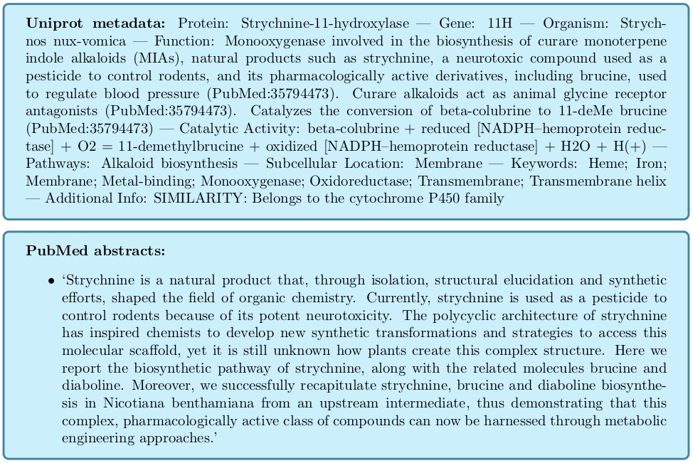

# LLM agent-based protein function prediction

<div align="center">

</div>

## Requirements

- Python 3.10
- PyTorch
- CAMEL-AI

## Setup

```bash
conda env create -f environment.yml
conda activate agenticfp
```


## Usage

Initially, we introduce a ProteinCentricAgent, which takes initial GO
function predictions and looks for potential overlooked terms to
refine its predictions. It relies on sources such as InterPro and
Diamond. It uses text descriptions of proteins and GO terms.

To run:

```bash
python function_agent.py
```

# Details:

* Model used: `google/gemini-2.0-flash-001`
* Protein agent is at: `agents/protein_centric_agent.py`

# Preliminary results:

## Molecular Function (MF) 
| Prediction Type | Fmax  | Smin  | AUPR  | AUC   |
|----------------|-------|-------|-------|-------|
| Initial (MLP)  | 0.642 | 7.364 | 0.642 | 0.957 |
| MLP+DS         | 0.706 | 6.177 | 0.712 | 0.964 |
| Gemini-Flash-2.0| 0.717| 5.861 | 0.697 | 0.943 |
| GPT-4.1 nano   | 0.712 | 6.173 | 0.713 | 0.964 |

## Cellular Component (CC) 
| Prediction Type | Fmax  | Smin  | AUPR  | AUC   |
|----------------|-------|-------|-------|-------|
| Initial (MLP)  | 0.693 | 7.530 | 0.723 | 0.936 |
| MLP+DS         | 0.718 | 6.365 | 0.755 | 0.949 |
| Gemini-Flash-2.0| 0.718| 6.554 | 0.717 | 0.944 |
| GPT-4.1 nano   | 0.727 | 6.333 | 0.748 | 0.949 |

## Biological Process (BP)
| Prediction Type | Fmax  | Smin   | AUPR  | AUC   |
|----------------|-------|--------|-------|-------|
| Initial (MLP)  | 0.414 | 27.440 | 0.354 | 0.868 |
| MLP+DS         | 0.463 | 25.495 | 0.402 | 0.874 |
| Gemini-Flash-2.0| 0.470| 25.219 | 0.401 | 0.873 |
| GPT-4.1 nano   | 0.460 | 25.515 | 0.401 | 0.874 |


## Example

We show and example of our how our method refines the predictions for
a protein:

<details>
<summary>Metadata retrieval</summary>
Before creating an agent, we retrieve information from UniProtKB and
PubMed. For example: for the protein with ID 11H\_STRNX we retrieve
the following information:

<div align="center">

</div>
</details>

<details>
<summary>Agent creation</summary>
    
Using the retrieved information from UniProtKB (**[uniprot_info]**) and PubMed (**[abstracts]**), we create
and agent and its role and context:

<div align="center">

</div>
</details>

<details>
<summary>Reasoning process</summary>

To start the reasoning process, we select initial GO term predictions
with scores $\geq 0.1$, and retrieve the following information:
* Initial MLP prediction score
* Diamond Score
* Definition and labels
* Taxonomical constraints

We denote this information as **[go_terms_info]**.
Then, we instruct the agent to analyze the GO terms and suggest refinements of predictions:

<div align="center">

</div>
</details>

# Data

We extend the `test.pkl` file with diamond predictions and uniprot text information run:

```
python diamond_preds.py
python get_protein_uniprot_info.py
```
